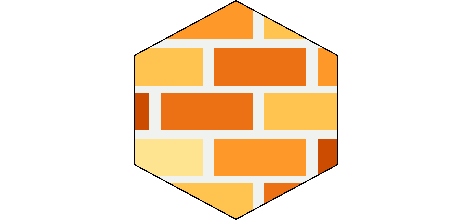

# Einstieg in die Sophos UTM

Wer sein Heim- oder B&uuml;ronetz seri&ouml;s absichern will, greift zu diesem Buch und beginnt seinen Einstieg in die Welt der UTMs von Sophos. Die Kapitel und Beispiele basieren auf der kostenfreien Home Edition.

__Erh&auml;ltlich ab August 2022 als E-Book oder gedrucktes Buch.__

Ein Blick ins [Inhaltsverzeichnis](Inhaltsverzeichnis.md).

## Unified Threat Management
Firewalls sind l&auml;ngst keine dummen Paketfilter mehr. Ein aktuelles _Unified Threat Management_ ist eine Allzweckwaffe gegen Bedrohungen aus dem Internet, aber auch aus lokalen Netzsegmenten. In den allermeisten Sicherheitskonzepten ist die Firewall ein essenzieller Baustein und selbst im modernen Zero-Trust-Modell ist sie vertreten.

Sophos tritt die Herausforderung an und besch&uuml;tzt Netzwerke auf unterschiedliche Weise. Dieses Buch ist der ideale Begleiter zum Verstehen, Installieren und Einrichten einer Sophos UTM.

## Netzdiagramm
Fast alle Kapitel benutzen denselben Netzaufbau und die gleichen IPv4/IPv6-Adressen. Das Netzdiagramm gibt es als Download im Format [PDF](Netzdiagramm.pdf) oder [PNG](Netzdiagramm.png).

## Ressourcen

* Was ist drin im Buch? Ein Blick ins [Inhaltsverzeichnis](Inhaltsverzeichnis.md) zeigt die behandelten Themen.

* Die Kommandoausgaben und Logdateien der UTMs aus den [Kapiteln](Kapitel/) zum Nachbauen oder f&uuml;rs Verst&auml;ndnis.

* Das [Korrekturverzeichnis](errata.pdf) listet die inhaltlichen Fehler und ihre Verbesserung.

* Buch kaufen bei [Amazon](https://www.amazon.de/dp/3756800482/) oder [BoD](https://www.bod.de/buchshop/einstieg-in-die-sophos-utm-markus-stubbig-9783756800483)

* Kontakt zum Autor per [E-Mail](mailto:sophos.buch@gmail.com)

* Fehler melden. [E-Mail](mailto:sophos.buch@gmail.com?subject=Fehler)

* [Stichwortverzeichnis](Stichwortverzeichnis.pdf)

* [Impressum](../../../sophos-buch.github.io/blob/master/Impressum.md)
